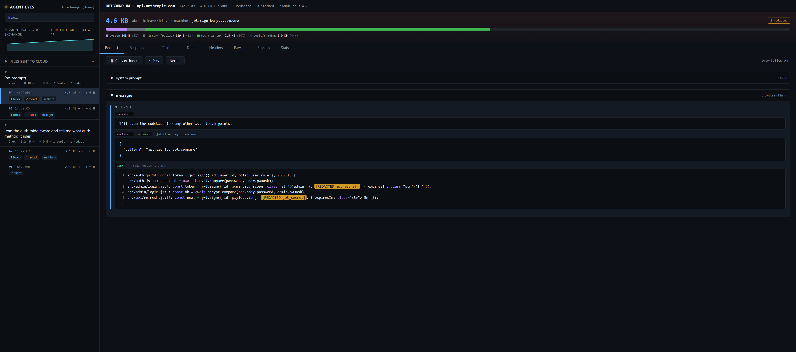

# Occasio

> Local-first audit chain for AI coding agents. Your prompts, your tool calls, your audit log; all on your machine, cryptographically verifiable later.

Occasio is a local proxy that sits between your AI coding agent (Claude Code, Cline, or anything that talks to the Anthropic API) and whichever LLM endpoint you configured. Every tool call passes through one human-readable policy file you control. You can see what is leaving your machine in real time, block what should not happen, and end up with a tamper-evident hash-chained log that a third party can verify offline months later if you ever need to prove what your agent did.

Nothing about Occasio sends data to a third party. There is no Occasio cloud, no Occasio account, no telemetry. Read [`docs/WHY-LOCAL.md`](docs/WHY-LOCAL.md) for the architecture, [`docs/COMPARE.md`](docs/COMPARE.md) for how this differs from cloud-hosted AI observability tools, and [`docs/SUSTAINABILITY.md`](docs/SUSTAINABILITY.md) for how a local-first product is funded under Apache 2.0.



*Screenshot: `occasio eyes --demo` against synthetic data — no real paths, no real traffic. The "(demo)" badge top-left is always shown in demo mode.*

```bash
npm install -g @occasiolabs/occasio

occasio demo audit       # Auditor scenario: signed attestation + cross-verifier proof (10s, no API key)
occasio demo attest      # End-to-end attestation pipeline against a synthetic chain
occasio demo anomalies   # Live EDR detection on a synthetic adversarial chain
occasio harness          # Real Claude Code attacking a denied path — defense holds
```

The first three demos run against synthetic data so you can see the full pipeline in seconds with no external dependencies. The fourth spawns a real Claude Code subordinate under your Anthropic login (bundled auth — no API key required) and proves the defense end-to-end. Start with `demo audit` — it answers the only question that actually matters: *"prove what your AI agent did in CI."*

---

## Two ways to use it

Most people land here for one of these — pick the column that fits and skim accordingly.

| | Daily dev work | CI / compliance |
|---|---|---|
| Question you're asking | "What is the agent actually sending to Anthropic, and what's it costing me?" | "Prove what the agent did during this run." |
| Main commands | `occasio eyes`, `occasio dashboard`, `--budget N`, `--eyes` | `occasio attest`, `occasio anomalies`, `occasio audit verify`, `occasio report` |
| What you get | Live browser UI on `127.0.0.1` — every outbound payload, byte breakdown, redactions in the clear | Signed in-toto attestation + tamper-evident chain, verifiable offline by Node, Python, or `cosign` |
| Jump to | [Live visibility — for developers](#live-visibility--for-developers) | [Verification](#verification) |

Both views read the same underlying log. You don't have to pick one — running the proxy gives you both for free.

---

## Quickstart

Requires Node.js ≥ 18. Works on Windows, macOS, Linux.

```bash
npm install -g @occasiolabs/occasio   # Install
occasio doctor                          # Verify setup (Node, claude CLI, port, profile)
occasio policy init                     # Write ~/.occasio/policy.yml (dev-default)
occasio register                        # Add 'claude' shell alias (one-time)
claude "read package.json and tell me the version"
```

After the alias is registered, every `claude` invocation routes through Occasio transparently. Audit-chain rows accumulate at `~/.occasio/pipeline-events.jsonl`.

**Inspect the run:**

```bash
occasio status                  # Session totals
occasio replay --detail         # Run-level audit
occasio audit verify            # Re-walk the hash chain end-to-end
occasio anomalies               # Run EDR detectors over the last 15 minutes
occasio attest --run-id <uuid>  # Build a behavioral attestation for one session
```

---

## Live visibility — for developers

The audit chain and signed attestations answer *"what did the agent do, prove it"* — the auditor's question. Sometimes you also want the simpler one: *"what is the agent doing **right now**?"* What is leaving your machine in this HTTP request. Which files have already gone to Anthropic in this session. What the system prompt looks like. What got redacted before it shipped.

`occasio eyes` is a local browser UI on `http://127.0.0.1:3002` that shows exactly that. Capture is opt-in via `--eyes` on the proxy; nothing leaves the machine, all storage stays under `~/.occasio/eyes/`.

```bash
occasio eyes --demo            # synthetic data, no proxy needed (10-second tour)
occasio claude --eyes          # then in another terminal:
occasio eyes                   # browser tab opens automatically
```

What you see:

- **Sidebar grouped by user prompt** — one "read the readme" expands into the 3–6 HTTP round-trips it actually took (Claude Code's agentic loop made visible).
- **Session sparkline + per-file aggregate** — outbound size over time, which files have been sent to the cloud and how often.
- **Per-exchange byte-decomposition** — stacked bar showing system / history (replay) / new-this-turn / tools-framing. The "small" request that's 124 KB is suddenly explainable: 108 KB of it is the same system prompt every time.
- **Tabs**: Request · Response · **Tools** (full local tool outputs — Read/Glob/Grep/Bash bytes that the interceptor handled locally and never sent up) · **Diff** (pre-transform vs sent — see the literal secrets that were redacted, in the clear, locally) · **Headers** · **Raw** SSE bytes · **Stats**.
- **Live flash overlay** when a new outbound lands — useful both for understanding and for demos.

### Screencast-safe view — `--sanitize`

Recording a demo or screenshot of `occasio eyes` against a real session normally
leaks your identity: home path (`C:\Users\<you>\...`), OS username, git email,
real name, hostname. The `--sanitize` flag replaces those with deterministic
pseudonyms in the display only — disk contents under `~/.occasio/eyes/` are
unchanged so your audit trail stays real.

```bash
occasio claude --eyes --sanitize    # capture as normal
occasio eyes --sanitize             # view with identity scrubbed
```

In the browser UI a cyan dot and `(sanitized)` badge confirm it's active.
Paths like `C:\Users\<you>\Desktop\proj` become `/home/user-7c/Desktop/proj`,
stable within a session.

**What `--sanitize` covers:** `$HOME` paths, OS username, git `user.email` /
`user.name`, hostname, and identity-carrying env vars (`USER`, `USERNAME`,
`LOGNAME`, `HOME`, `USERPROFILE`).

**What it does *not* cover — review before sharing:**
- Project paths outside `$HOME` (e.g. `D:\Work\Acme\…`)
- Git remote URLs in tool outputs (`github.com:org/repo` leaks the org name)
- File contents — your name in a comment, commit message, or README is not
  auto-detected. Sanitize keys off identity values it can discover from the
  OS and git, not arbitrary substrings.
- The Claude Code TUI banner ("Welcome back X", organization line) — that
  prints before any HTTP traffic and bypasses Eyes entirely. Crop it from
  the screencast manually.

The flag is a *display filter*, not a recording mode. The same Eyes capture
can be replayed unsanitized later (just run `occasio eyes` without the flag).

### Dashboard vs. Eyes

Both run as local browser UIs but answer different questions:

| | `occasio dashboard` (3001) | `occasio eyes` (3002) |
|---|---|---|
| Focus | Session-level metrics: cost, savings, tokens | Per-exchange traffic: what went out, what came back |
| Granularity | Aggregate counters + per-request summary table | Full HTTP bodies, decoded SSE, local tool outputs |
| Capture needed | No — reads `session.json` + daily logs | Yes — pass `--eyes` to the proxy (opt-in) |
| Data scope | Metadata only | Full payload bytes (kept locally under `~/.occasio/eyes/`) |
| Best for | "How much have I spent today?" | "What did the agent actually send to Anthropic?" |

Both live on `127.0.0.1` only. No CORS, no auth, no external network.

---

## Commands

| Command | What it does |
|---|---|
| `occasio claude [args]` | Start Claude Code with Occasio proxy active |
| `occasio register` | Register `claude` shell alias |
| `occasio doctor` | Setup health-check |
| `occasio status` | Session totals + savings breakdown |
| `occasio replay` | Run-level audit (`--detail`, `--run <id>`, `--attribute`) |
| `occasio inspect` | Per-request cloud-boundary manifest |
| `occasio boundary` | Three-column view: produced / re-entered / prevented |
| `occasio ledger` | Per-request token ledger |
| `occasio distill` | Inspect distilled tool outputs |
| `occasio dashboard` | Live browser dashboard at http://localhost:3001 (session metrics) |
| `occasio eyes` | Browser UI at http://127.0.0.1:3002 (per-exchange traffic, capture opt-in via `--eyes`) |
| `occasio audit verify` | Re-walk the SHA-256 audit chain end-to-end |
| `occasio audit repair --file <path>` | Truncate a crash-partial trailing line (writes `.bak`) |
| `occasio report` | Governance summary export (`--days N`, `--format csv`) |
| `occasio anomalies` | EDR detection over the audit chain (`--window 15m`, `--json`) |
| `occasio attest --run-id <uuid>` | Build a behavioral attestation predicate v1 |
| `occasio attest --sign` | Sigstore-sign via GitHub Actions OIDC |
| `occasio attest verify <file>` | Re-verify a signed attestation end-to-end |
| `occasio policy [show \| validate \| init \| doctor]` | Policy authoring + diagnosis |
| `occasio harness` | Run scripted adversarial scenarios against your policy |
| `occasio redteam` | Autonomous tester-LLM probes a subject Claude Code session |
| `occasio computer-use --dry-run` | Apply a Computer-Use policy to synthetic tool_use blocks |
| `occasio demo attest` | End-to-end attestation pipeline against a synthetic chain |
| `occasio demo anomalies` | EDR smoke test: synthetic adversarial chain → all 4 detectors |
| `occasio selftest` | In-process governance self-checks on a scratch chain |
| `occasio baseline [learn \| compare]` | Per-project behavior baseline + drift detection |
| `occasio preflight` | Read-only mine of recent activity for policy suggestions |

Session-level overrides on top of `policy.yml`:

| Flag | Effect |
|---|---|
| `--preset strict` | Forces `block_secrets_in_tool_results` on for the session |
| `--preset off` | Pure passthrough, log only |
| `--budget <N>` | Hard cap: HTTP 402 once session cost reaches $N |
| `--hardened` | Routes Read/Glob/Grep through unified runtime + distill + secret scan |
| `--eyes` | Capture outbound + inbound payloads for `occasio eyes` browser UI |

---

## What it does, in four layers

Under the hood, four layers do the work — Layers 1–2 every run, Layers 3–4 when you ask for an attestation or run the detectors.

**Layer 1 — Tool-call interception.** A local proxy sits between the agent and the Anthropic API. `Read`, `Glob`, `Grep`, `TodoRead`/`TodoWrite` run in-process on your machine; the file bytes never enter the outbound request. A curated set of read-only shell commands (`git status`, `git log --oneline -N`, with or without `git -C <path>`, plus `echo` / `cd` cwd-prefix chains) are also executed in-process. Other shell reads (`cat <file>` and similar) are policy-analyzed for embedded read paths so `deny_paths` enforces consistently, but the command itself executes server-side via the Bash tool.

**Layer 2 — Policy enforcement.** Every tool call hits one decision: `LOCAL` / `PASS` / `BLOCK` / `TRANSFORM`, driven by [`policy.yml`](policy-templates/dev-default.yml). `deny_paths` is enforced on the realpath-resolved absolute path so symlinks and traversal variants resolve to the same denial. `block_secrets_in_tool_results` redacts API keys and JWTs out of any tool output before it re-enters the prompt. Hot-reload: edits to `policy.yml` take effect on the next call, with a `policy_loaded` row written to the audit chain.

**Layer 3 — Behavioral attestation.** `occasio attest --run-id <uuid>` produces a self-contained JSON predicate that commits to the full audit-chain slice for one agent session: every tool call, every block, every transform, every redacted secret, plus the active policy's SHA-256 hash and rules digest. `--sign` wraps it in an [in-toto Statement v1](https://github.com/in-toto/attestation) and Sigstore-signs it using GitHub Actions OIDC (no key management). The predicate type URI is [`agent-attestation/v1`](spec/agent-attestation/v1/README.md). Two independent reference verifiers ship — Node (`occasio attest verify`) and Python ([`docs/attest_verify.py`](docs/attest_verify.py)) — and the test suite asserts they agree byte-for-byte on the same payload.

**Layer 4 — Anomaly detection (EDR).** `occasio anomalies` runs four detectors over a time window of the audit chain: deny-rate spike, file-read-volume burst, previously-unseen tool-input shape, secret-redaction-rate spike. Severity escalates against your historical baseline — roughly a ×10–×20 ratio above normal triggers HIGH at the detector level; against a sparse normal baseline the observed multipliers in practice land between ×100 and ×1000. See [`docs/edr-demo.md`](docs/edr-demo.md) for the reproducible defense-in-depth walkthrough.

---

## Architecture

```
agent (Claude Code / Cline / MCP / Computer Use)
  │
  ▼  tool call
┌──────────────────────────────────────────────────────────────┐
│  Occasio proxy                                            │
│                                                              │
│  Layer 1: adapter parse → canonical event                    │
│  Layer 2: policy decision (LOCAL / PASS / BLOCK / TRANSFORM) │
│  Layer 2: deny_paths + deny_patterns + secret redaction      │
│  Layer 2: native dispatch for LOCAL/TRANSFORM tools          │
│           ──► row appended, SHA-256-chained                  │
│  Layer 4: anomaly detectors (windowed, on-demand or live)    │
└──────────────────────────────────────────────────────────────┘
  │
  ▼  cloud-bound: only PASS calls, with shaped result if TRANSFORM
Anthropic API

End of session
  │
  ▼  occasio attest --run-id … --sign
Layer 3: signed in-toto Statement → Sigstore bundle → GitHub Check Run
  │
  ▼  independent verifier
Node / Python / cosign — all must agree
```

---

## Verification

Three independent checks, all required for a verified attestation:

1. **Sigstore signature** — Fulcio certificate chain + Rekor inclusion proof. Verifiable by any sigstore-conformant tool (`cosign verify-blob`, `sigstore-js`, `sigstore-python`).
2. **DSSE payload ↔ attestation predicate equivalence** — re-decode the in-toto Statement inside the bundle, canonicalise the predicate via [RFC 8785 subset](src/attest/canonicalize.js), compare byte-for-byte with the attestation predicate (minus the `signature` metadata field).
3. **Audit chain integrity** — SHA-256-walk every `prev_hash → hash` link from the GENESIS sentinel, then assert the attestation's `first_hash` and `last_hash` appear in the chain in the right relative order.

Two reference verifiers ship side by side:

- **Node**: `occasio attest verify <file>`
- **Python**: `python docs/attest_verify.py <file>` — stdlib + optional `sigstore-python`, reuses [`docs/audit_walker.py`](docs/audit_walker.py) for the chain step. See [`docs/python-verifier.md`](docs/python-verifier.md).

**Cross-language invariant** (asserted in the test suite as `xlang:` and `xlang-float:` cases): both verifiers agree byte-for-byte on the predicate-equivalence and audit-chain steps for the same payload, including tamper-detection cases. Non-integer numbers are rejected by both canonicalize implementations so a future schema cannot silently introduce divergence.

The **Sigstore signature step** uses the standard DSSE-wrapped in-toto Statement format; any sigstore-conformant tool verifies it (`cosign verify-blob`, `sigstore-js`, `sigstore-python`). The test suite mocks the signing path; a real-OIDC end-to-end signed-and-verified round-trip requires a GitHub Actions environment and is exercised by the [`integrations/attest-action/`](integrations/attest-action/) workflow in CI.

A third partial verifier runs in-browser at [`integrations/attest-view/`](integrations/attest-view/) for drag-and-drop inspection. The browser performs the predicate-equivalence and audit-chain steps but defers Sigstore certificate-chain verification to one of the two CLIs (bundling Fulcio/Rekor trust roots in-browser is intentionally not done; the page is explicit about it).

---

## Why now

Three regulatory drivers, all converging on the same requirement: **runtime evidence of AI-agent behavior must be cryptographically verifiable.**

- **EU AI Act Art. 12** mandates comprehensive automated logging of high-risk AI systems. In effect from 2026 for regulated sectors.
- **NIST AI RMF (GOVERN, MEASURE, MANAGE families)** is becoming required in US Federal procurement and is influencing FedRAMP AI controls.
- **SOC 2 Common Criteria** are extending to AI-agent controls — auditors at major firms started asking "show me the agent's tool-call log" in 2026 audits.

There is currently no off-the-shelf product producing a signed, third-party-verifiable artifact for what an AI coding agent did inside your CI. Occasio fills that gap with an open schema (Apache-2.0) and ships the reference implementations for it.

---

## Log format

All data is stored locally at `~/.occasio/`:

```
~/.occasio/
  pipeline-events.jsonl        # tamper-evident audit chain (SHA-256 linked)
  policy.yml                   # active policy
  session.json                 # current run_id, totals
  logs/YYYY-MM-DD.jsonl        # per-request log
  baseline/<cwd-hash>.json     # per-project behavior baseline (opt-in)
  eyes/                        # `occasio eyes` capture (opt-in via --eyes)
    payload-NNNNNN.json        # per-exchange metadata + extracted blocks
    content/<sha>              # content-addressed blob store (file bytes,
                               # tool outputs) — dedup by SHA-256
```

The audit-chain row schema is documented in [`docs/AUDIT.md`](docs/AUDIT.md). Each row carries `prev_hash` and `hash` (SHA-256 hex), with the first row chained from a fixed GENESIS sentinel (64 zeros). `occasio audit verify` and `docs/audit_walker.py` are independent implementations of the walker.

---

## Demos

- [**EDR defense-in-depth**](docs/edr-demo.md) — real Claude Code attacking a denied path under your policy, all blocks held, EDR fires HIGH ×100–×1000 over baseline. Reproducible in <2 minutes.
- [**Reference Pipeline**](docs/reference-pipeline.md) — PR with AI-agent → GitHub Action signs attestation via Sigstore keyless → Check Run on the PR → independent verification offline.
- [**Cross-protocol governance**](docs/demos/mcp-block.md) — the same `deny_paths` rule producing identical `BLOCK` rows under Claude Code's HTTP proxy and the MCP server.

---

## Reference

- [`spec/agent-attestation/v1/README.md`](spec/agent-attestation/v1/README.md) — predicate type specification
- [`schemas/agent-attestation-v1.json`](schemas/agent-attestation-v1.json) — authoritative JSON Schema
- [`docs/AUDIT.md`](docs/AUDIT.md) — audit-chain row schema and canonical-serialisation rules
- [`docs/compliance-mapping.md`](docs/compliance-mapping.md) — SOC 2 Common-Criteria mapping
- [`docs/python-verifier.md`](docs/python-verifier.md) — independent Python verifier
- [`docs/edr-demo.md`](docs/edr-demo.md) — defense-in-depth walkthrough
- [`docs/reference-pipeline.md`](docs/reference-pipeline.md) — end-to-end CI pipeline
- [`integrations/attest-action/`](integrations/attest-action/) — GitHub Action that signs + posts a Check Run
- [`integrations/attest-view/`](integrations/attest-view/) — static browser viewer for attestation files

---

## Requirements

- **Node.js ≥ 18**
- **Claude Code** (`npm install -g @anthropic-ai/claude-code`) — or any agent that respects `ANTHROPIC_BASE_URL`
- **Python 3** (optional) — required for the independent verifier and LAO context trimming
- **`sigstore-python`** (optional) — adds the cryptographic Sigstore step to the Python verifier

---

## License

Occasio is open source under the [Apache License 2.0](LICENSE), including an explicit patent grant for safe enterprise use. Versions 0.6.6 and earlier were released under the MIT License and remain MIT in perpetuity for those releases.

Contributions are accepted under Apache-2.0; please sign off your commits per the [DCO](https://developercertificate.org/) (`git commit -s`).
